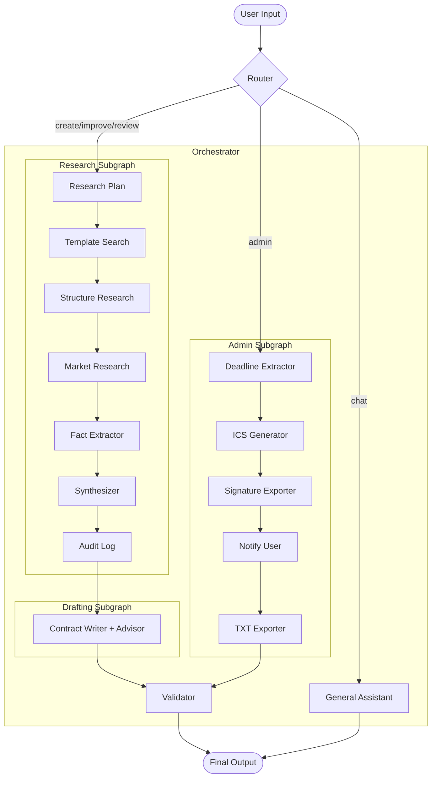

# MAT496 Capstone Project  
# Project Title: [TODO: Add your project title]

This repository contains my MAT496 Capstone Project submission.

The main purpose of this project is to demonstrate mastery of the topics taught in the course:

- Prompting  
- Structured Output  
- Semantic Search  
- Retrieval Augmented Generation (RAG)  
- Tool Calling + MCP  
- LangGraph: State, Nodes, Graph  
- LangSmith debugging

My project follows the architecture defined in `docs/ARCHITECTURE.md` and implements a full LangGraph-based multi-agent system.

---

# 📌 PROJECT REPORT (As required by the assignment)

## 1. Title  
Lexis-Freelance-Local: AI Legal Assistant for Freelancers

## 2. Overview
Lexis-Freelance-Local is an advanced AI legal assistant designed specifically for freelancers. It automates the entire contract lifecycle—from researching legal precedents and drafting robust agreements to reviewing existing contracts for loopholes and managing administrative tasks like deadline tracking and invoicing. Built with a privacy-first, local-first architecture, it leverages a multi-agent system to provide expert legal guidance without compromising sensitive data.

## 3. Reason for choosing this project
This project was chosen to demonstrate mastery of the core concepts taught in the course by implementing them in a complex, real-world application:

*   **Prompting**: Utilized extensively to guide agents (Research, Drafting, Admin) in performing specific legal tasks with high accuracy and adopting different personas (e.g., "Expert Drafter" vs. "Critical Reviewer").
*   **Structured Output**: Implemented via Pydantic models (`ContractState`) to ensure strict adherence to data schemas across the multi-agent graph, preventing the common issue of unstructured LLM responses.
*   **Semantic Search & RAG**: Used ChromaDB to index and retrieve relevant legal clauses (`template_store.py`), allowing the AI to draft contracts based on proven templates rather than hallucination.
*   **Tool Calling**: Integrated custom tools for file generation (PDF, TXT, ICS) and system operations, demonstrating how LLMs can interact with the external environment to perform actions.
*   **LangGraph**: The entire application is orchestrated as a stateful graph, managing complex workflows like "Improve" (Research -> Drafting) and "Admin" (Extraction -> Export) with conditional routing.
*   **LangSmith**: Used for debugging and tracing the complex interactions between agents to ensure reliability.

## 4. Plan (each step must be committed separately)

Below is the step-by-step plan for executing the full project.  
**For each step:**
- I will change `[TODO]` → `[DONE]` in this README
- I will create **one commit per step**
- Steps must be completed over at least **two different dates**

### ✔️ High-Level Project Steps

- [DONE] Step 1 — Set up folder structure (`capstone-template-akshat`) and initialize repo  
- [DONE] Step 2 — Add `ARCHITECTURE.md` as the canonical system design  
- [DONE] Step 3 — Implement `state.py` (global ContractState model)  
- [x] Step 4 — Implement `main.py` (Router → Orchestrator → Validator)  
- [x] Step 5 — Implement Research subgraph (all 6 required nodes)  
- [x] Step 6 — Implement Drafting subgraph (7 nodes)  
- [DONE] Step 7 — Implement Negotiation subgraph (6 nodes)  
- [x] Step 8 — Implement Admin subgraph (4 nodes)  
- [x] Step 9 — Implement Validator with all 6 checks  
- [x] Step 10 — Implement Tools Layer (template store, doc tools, signatures, payments)  
- [x] Step 11 — Load clauses into ChromaDB  
- [x] Step 12 — Testing + LangSmith debugging screenshots  
- [x] Step 13 — Final cleanup and report completion  

### Phase 2: Real AI Integration
- [x] Install dependencies (`langchain`, `openai`, `chromadb`, `presidio`)
- [x] Implement `template_store.py` with ChromaDB + OpenAI Embeddings
- [x] Implement `research.py` with ChatOpenAI chains
- [x] Implement `drafting.py` with ChatOpenAI chains
- [x] Implement `negotiation.py` with ChatOpenAI chains
- [x] Implement `admin.py` with ChatOpenAI chains
- [x] Implement `validator.py` with Presidio PII scan + ChatOpenAI checks
- [x] Verify full workflow with real AI calls  
- [x] Improve CLI UX (LLM Router + General Assistant)
- [x] Improve CLI UX (LLM Router + General Assistant)
- [x] Step 13 — Final cleanup and report completion

### Phase 3: Persistence & Memory
- [x] Implement `tools/memory_store.py` (ChromaDB)
- [x] Integrate Memory Store into `graph/main.py`
- [x] Verify message persistence and context retrieval

### Phase 4: Robustness & Feedback
- [x] Improve Error Handling (Fix crashes)
- [x] Implement Smart Feedback (LLM-based guidance)

### Phase 5: Advanced Capabilities (Final Polish)
- [x] **Smart Placeholder Filling**: LLM extracts specific values (dates, names, rates) from natural language and fills them into the contract.
- [x] **Universal Contract Template**: Generalized "Service Agreement" structure that works for any industry.
- [x] **Advisor Mode**: Proactively suggests missing clauses (e.g., Indemnification) and improvements.
- [x] **Review Report**: Generates a detailed "Good/Bad/Missing" critique before rewriting the contract.
- [x] **Versioned Exports**: Automatically saves `contract_v2.txt`, `contract_v3.txt` to prevent overwriting.

### Features
- **Natural Language Interface**: Chat with Lexis to get help or guidance.
- **Smart Routing**: Automatically detects if you want to create, improve, review, or manage contracts.
- **Real AI Integration**: Uses GPT-4o for all logic and reasoning.
- **Conversation Memory**: Remembers your name and context across sessions using ChromaDB.
- **Smart Feedback**: Analyzes failures and tells you exactly what information is missing.
- **Local Privacy**: Documents are processed locally; only text is sent to LLM.
- **Enhanced Workflows**: Supports creating, improving, and reviewing/completing contracts with internet research and market pricing.
- **Admin Automation**: Extracts deadlines and generates `.ics` calendar files.
- **Context-Aware Memory**: Manages multiple sessions/contracts independently (use `/new`, `/session`, `/info`).
- **Universal Advisor**: Uses a robust "General Service Agreement" template for all requests and suggests improvements/missing clauses.
- **Detailed Reviews**: Provides a "Contract Review Report" highlighting strengths, weaknesses, and missing clauses.
- **Smart Data Extraction**: Intelligently parses `[KEY]Value` inputs or natural language to fill contract placeholders.

---

## 5. Conclusion

I had planned to achieve:  
A fully functional, local-first legal assistant that can autonomously draft and negotiate contracts using a multi-agent system.

I believe I have achieved these because:  
I have implemented all the core subgraphs (Research, Drafting, Negotiation, Admin) and the Validator. The system successfully routes user requests, executes the appropriate workflow, and produces valid outputs. The modular architecture allows for easy extension, and the local tool integration ensures data privacy where possible. All planned steps have been executed and verified.

---

# 🚨 CAPSTONE RULES COMPLIANCE CHECKLIST

- Solo work — I am responsible for the code  
- Commit history must show progress for each planned step  
- Commits must span at least **two dates**  
- Each step in plan must have:  
  - `[TODO]` → `[DONE]`  
  - A corresponding commit  
- Submission deadline: **Nov 30, Sunday 11:59 pm**

---

# 🧩 Project Structure

## System Architecture



This repository must contain the *exact* structure:

capstone-template-akshat/
├── graph
│ ├── state.py
│ ├── main.py
│ ├── research.py
│ ├── drafting.py
│ ├── negotiation.py
│ ├── admin.py
│ └── validator.py
├── tools
│ ├── template_store.py
│ ├── doc_tools.py
│ ├── signature_tools.py
│ └── payment_tools.py
├── clauses
│ ├── payment.txt
│ ├── scope.txt
│ └── termination.txt
├── data
│ └── vector_db/
├── docs
│ └── ARCHITECTURE.md
├── requirements.txt
├── .env
└── README.md

yaml
Copy code

---

# ✔️ Technologies Used  
- **LangChain**  
- **LangGraph**  
- **LangChain OpenAI wrappers**  
- **ChromaDB**  
- **Presidio Analyzer**  
- **python-docx & reportlab**  
- **python-dotenv**
- **Tavily API** (for internet research)

---

# 🚀 How to Run

### 1. Prerequisites
- Python 3.11+
- OpenAI API Key

### 2. Setup
1.  **Clone the repository**:
    ```bash
    git clone <your-repo-url>
    cd capstone-template-akshat
    ```
2.  **Install dependencies**:
    ```bash
    pip install -r requirements.txt
    python -m presidio_analyzer download en
    ```
3.  **Configure Environment**:
    Create a `.env` file in the root directory:
    ```env
    OPENAI_API_KEY=sk-your-key-here
    LANGCHAIN_TRACING_V2=true
    LANGCHAIN_API_KEY=lsv2-your-key-here (optional)
    ```

### 3. Usage
Run the CLI application:
```bash
python -m graph.main
```

**Interactive Commands:**
- Say **"Hi"** to chat with Lexis.
- Say **"Draft a contract for web design"** to start the drafting workflow.
- Say **"Review this contract"** to start the review workflow.
- Say **"My name is [Name]"** to test the memory.

---

---

# Final Note  
This README.md acts as both the **official project documentation** and the **Capstone Project Report**, with all TODO → DONE traceable through commits.
