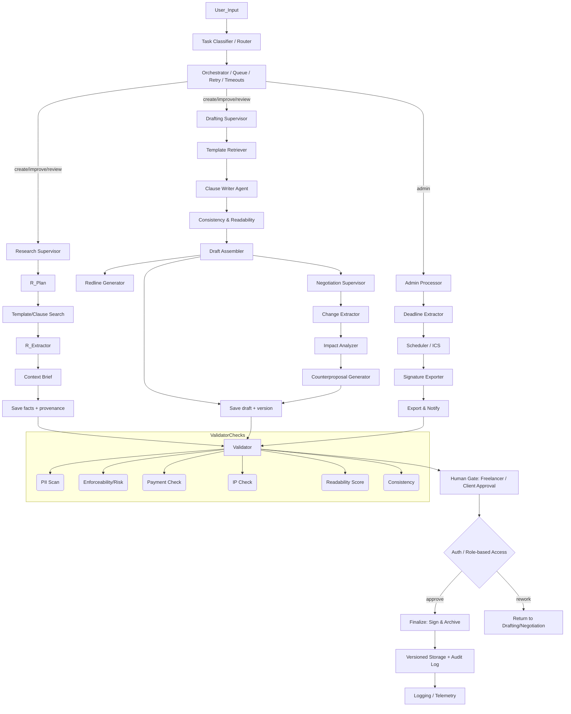

# Architecture Documentation
# LEXIS-FREELANCE-LOCAL — CONTRACT LEGAL ASSISTANT  
**System Architecture Documentation**  
**Version:** 1.0  
**Audience:** Antigravity Builder / LLM Code Generator  
**Purpose:** THIS FILE IS THE SINGLE SOURCE OF TRUTH FOR THE ENTIRE PROJECT.  
Antigravity must follow EVERY instruction exactly and must NOT invent, skip, compress, or “optimize” any structure or logic not explicitly stated here.

---

# 1. SYSTEM OVERVIEW

Lexis-Freelance-Local is a **local-only**, **CLI-driven**, **multi-agent legal assistant** designed to help freelancers:

- create contracts  
- improve contracts  
- review contracts  
- negotiate revisions  
- export final versions  

The system uses:

- **LangGraph** → for full workflow orchestration  
- **LangChain** → for LCEL chains, prompt templates, LLM wrappers, vector retrieval, and tool interfaces  
- **ChromaDB** → for local vector store of contract clauses  
- **Presidio** → for PII scanning  
- **Local JSON-based checkpointing** → NOT SQL, NOT remote DB  

⚠️ **This system does NOT provide legal advice.**  
Outputs are suggestions only.

---

# 2. TECH STACK (MANDATORY)

Antigravity MUST use these technologies exactly:

| Component | Technology |
|----------|------------|
| Language | Python 3.11+ |
| Orchestration | LangGraph (state machine) |
| LLM Framework | LangChain (LCEL chains + tools + prompts) |
| LLM Provider | OpenAI (via `langchain-openai`) |
| Vectorstore | ChromaDB (local) |
| PII Detection | Presidio Analyzer |
| File Generation | python-docx, reportlab |
| Environment | python-dotenv |
| Entry | CLI script only (main.py) |

NO UI  
NO FastAPI  
NO Streamlit  
NO web server  
NO SQL database  

---

# 3. PROJECT FOLDER STRUCTURE  
Antigravity must create these folders EXACTLY:

```

/lexis-freelance-local
├── graph
│   ├── state.py
│   ├── main.py
│   ├── research.py
│   ├── drafting.py
│   ├── negotiation.py
│   ├── admin.py
│   └── validator.py
├── tools
│   ├── template_store.py
│   ├── doc_tools.py
│   ├── signature_tools.py
│   └── payment_tools.py
├── clauses
│   ├── payment.txt
│   ├── scope.txt
│   └── termination.txt
├── data
│   └── vector_db/
├── docs
│   └── ARCHITECTURE.md
├── requirements.txt
├── .env
├── .gitignore
└── README.md

````

NO additional files or folders should be created unless explicitly requested in future user instructions.

---

# 4. GLOBAL STATE MODEL  
Located at: `graph/state.py`

Antigravity MUST create a Pydantic model named **ContractState** with EXACTLY these fields:

```python
class ContractState(BaseModel):
    messages: List[Dict[str, Any]] = []
    task_category: Optional[str] = None   # "create", "improve", "review", "admin"
    extracted_facts: Dict[str, Any] = {}
    draft_content: Optional[str] = None
    versions: List[Dict[str, Any]] = []
    validation_report: Dict[str, Any] = {}
    human_feedback: Optional[str] = None
    signatures: Dict[str, Any] = {}
    signatures: Dict[str, Any] = {}
    payment_schedule: Optional[Dict[str, Any]] = None
    contract_structure: Optional[str] = None
    market_terms: Optional[str] = None
````

NO additional attributes may be added.

---

# 5. ROOT WORKFLOW (LangGraph)

`graph/main.py` MUST:

1. Load `.env`
2. Implement a Router class
3. Implement an Orchestrator class
4. Implement JSON checkpointing to `./data/state.json`
5. Accept user text input from CLI
6. Run the following workflow in order:

```
Router → Subgraph (Research/Drafting/Negotiation/Admin) → Validator → Checkpoint → Print Summary
```

There is **NO server**, **NO UI**, **NO async**, **NO parallelism**.

---

# 6. ROUTER

The Router MUST classify input text into exactly one of:

* `"create"`
* `"improve"`
* `"review"`
* `"admin"`

Fallback is `"create"`.

NO additional categories allowed.

---

# 7. SUBGRAPHS

Each subgraph is implemented as a file in `/graph/`.

Each subgraph MUST include:

* A Supervisor class
* A `run(state: ContractState) -> ContractState` method
* Use LangChain components (LLM wrappers, LCEL, prompt templates, retrievers)

Business logic may be TODO stubs, but the structure MUST match this architecture.

---

# 7.1 RESEARCH SUBGRAPH (`graph/research.py`)

### Nodes in strict order:

1. **Research Supervisor**
2. **Plan Node** (LCEL chain)
3. **Template/Clause Search** (LangChain + Chroma retriever)
4. **Structure Research Node** (Tavily Search)
5. **Market Research Node** (Tavily Search)
6. **Extractor Node** (LLM chain or rule-based)
7. **Synthesizer Node: Contract Brief** (Structure + Market Terms + Facts)
8. **Audit Node** (save facts + provenance)

Each node MUST append an entry to `state.messages`.

---

# 7.2 DRAFTING SUBGRAPH (`graph/drafting.py`)

### Nodes in strict order:

1. **Drafting Supervisor**
2. **Template Retriever** (Chroma + LangChain Retriever)
3. **Contract Writer Agent** (LLM chain generating FULL contract with placeholders)
4. **Consistency & Readability Checker**
5. **Draft Assembler** (combines text)
6. **Redline Generator** (simple diff)
7. **Draft Audit Node** (version save)

Again, each node MUST append to `state.messages`.

---

# 7.3 NEGOTIATION SUBGRAPH (`graph/negotiation.py`)

### Nodes in strict order:

1. **Negotiation Supervisor**
2. **Change Extractor**
3. **Impact Analyzer** (LCEL chain)
4. **Counterproposal Generator**
5. **Versioning Node**
6. **Policy Gate**

Append messages to state.

---

# 7.4 ADMIN SUBGRAPH (`graph/admin.py`)

### Nodes:

1. **Deadline Extractor**
2. **Scheduler / ICS Generator**
3. **Signature Exporter** (PDF output using python-docx/reportlab)
4. **Export & Notify**

---

# 8. VALIDATOR (`graph/validator.py`)

Validator MUST run after ALL subgraphs.

Validator MUST include:

1. **PII Scan (Presidio)**
2. **Enforceability/Risk Scan**
3. **Payment Check**
4. **IP Ownership Check**
5. **Readability Score**
6. **Consistency Check**
7. Append `"validator_run"` to state.messages
8. Write full dict to `state.validation_report`

NO legal advice may be generated — only flags and warnings.

---

# 9. LOCAL PERSISTENCE

`checkpoint_state(state)` MUST:

* Serialize state.dict()
* Save to `./data/state.json`

`load_checkpoint()` MUST:

* Load JSON if exists
* Else return new ContractState()

---

# 10. TOOLS LAYER (LangChain-powered & local)

Located in `/tools`.

### REQUIRED MODULES:

* `template_store.py` → ChromaDB initialization + LC retriever
* `doc_tools.py` → PDF & DOCX generation
* `signature_tools.py` → E-sign placeholder
* `payment_tools.py` → Invoices & schedules (placeholders)

Each tool MUST return deterministic placeholder values and print simple logs.

---

# 11. CLAUSE FILES

Antigravity MUST create:

```
clauses/payment.txt
clauses/scope.txt
clauses/termination.txt
```

These are loaded into ChromaDB.

Do NOT modify their text unless explicitly instructed by user.

---

# 12. MERMAID DIAGRAM

This diagram MUST appear exactly as-is.



---

# 13. NON-NEGOTIABLE RULES

Antigravity MUST obey:

1. **Do NOT hallucinate.**
2. **Do NOT create extra nodes, files, classes, or prompts.**
3. **Do NOT merge or collapse nodes.**
4. **Do NOT rewrite system design on its own.**
5. **Do NOT introduce servers or UI.**
6. **Do NOT output legal advice.**
7. **All LangChain chains MUST use LCEL.**
8. **All subgraphs MUST append messages to `state.messages`.**
9. **All checkpoint files MUST be written to `./data/state.json`.**
10. **If unsure, STOP and ask the user.**

---

# 14. GLOSSARY

* **Subgraph:** file containing one workflow stage.
* **Supervisor:** class directing node-level logic.
* **Clause Writer Agent:** LangChain Runnable chain generating contract clauses.
* **Context Brief:** summary of external clause retrieval.
* **Versioning Node:** stores new drafts.
* **Human Gate:** manual approval checkpoint.
* **Provenance:** source info stored alongside clauses.
* **LCEL:** LangChain expression language (`RunnableSequence`, etc.).

---

# 15. FINAL NOTE

THIS DOCUMENT IS COMPLETE AND AUTHORITATIVE.
Antigravity MUST treat this file as the **canonical specification** and produce all code and folder structure EXACTLY according to these instructions.


